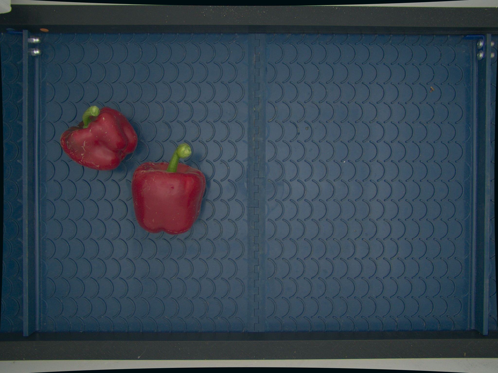
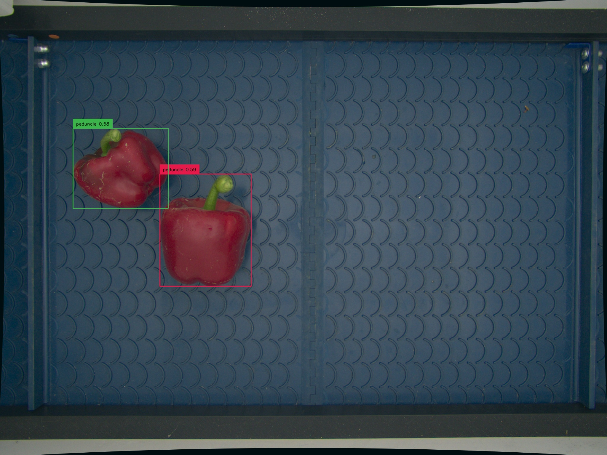
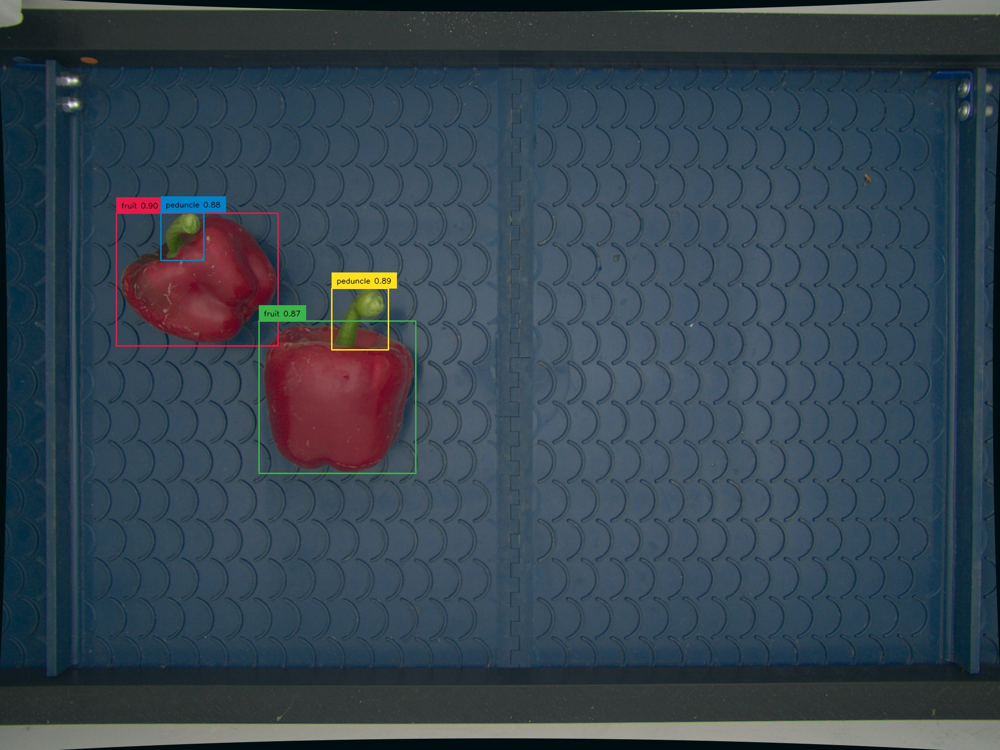

# Grounding DINO Fine-tuning 🦖


We have expanded on the original DINO  repository 
https://github.com/IDEA-Research/GroundingDINO 
by introducing the capability to train the model with image-to-text grounding. This capability is essential in applications where textual descriptions must align with regions of an image. For instance, when the model is given a caption "a cat on the sofa," it should be able to localize both the "cat" and the "sofa" in the image.

## Features:

- **Fine-tuning DINO**: This extension works allows you to fine-tune DINO on your custom dataset.
- **Bounding Box Regression**: Uses Generalized IoU and Smooth L1 loss for improved bounding box prediction.
- **Position-aware Logit Losses**: The model not only learns to detect objects but also their positions in the captions.
- **NMS**: We also implemented phrase based NMS to remove redundant boxes of same objects


## Installation:
See original Repo for installation of required dependencies essentially we need to install prerequisits and 

## Train: 

1. Prepare your dataset with images and associated textual captions. A tiny dataset is given multimodal-data to demonstrate the expected data format.
3. Run the train.py for training.
  ```
  python train.py
  ```

## Test:
Visualize results of training on test images
```
python test.py
```

## Known Limitations/TO DO:

1. Currently Support only one image allow batching 
2. Add model evaluations
3. We did not added auxilary losses as mentioned in the original paper, as we feel we are just finetuning an already trained model but feel free to add auxilary losses and compare results

## Visual Results

For Input text "peduncle.fruit." and input test image 

<div align="center">

</div> 


## Before Fine-tuning


<div align="center">

</div> 

Intially model detects the wring category and does not detect peduncle (green part) of the fruits

## After Fine-tuning
<div align="center">

</div> 

After fine tuning the model can detect the right category of objects with high confidence and detect all parts of fruits as mentioned in text.


## Contributing
Feel free to open issues, suggest improvements, or submit pull requests. If you found this repository useful, consider giving it a star to make it more visible to others!
