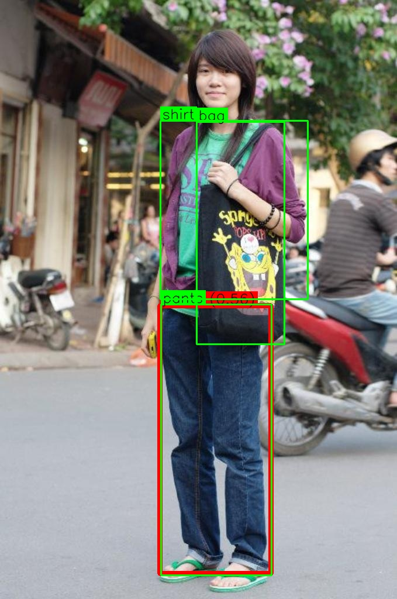
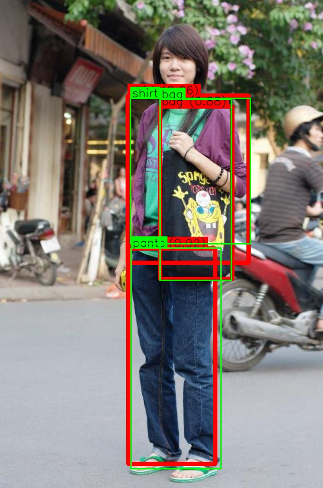
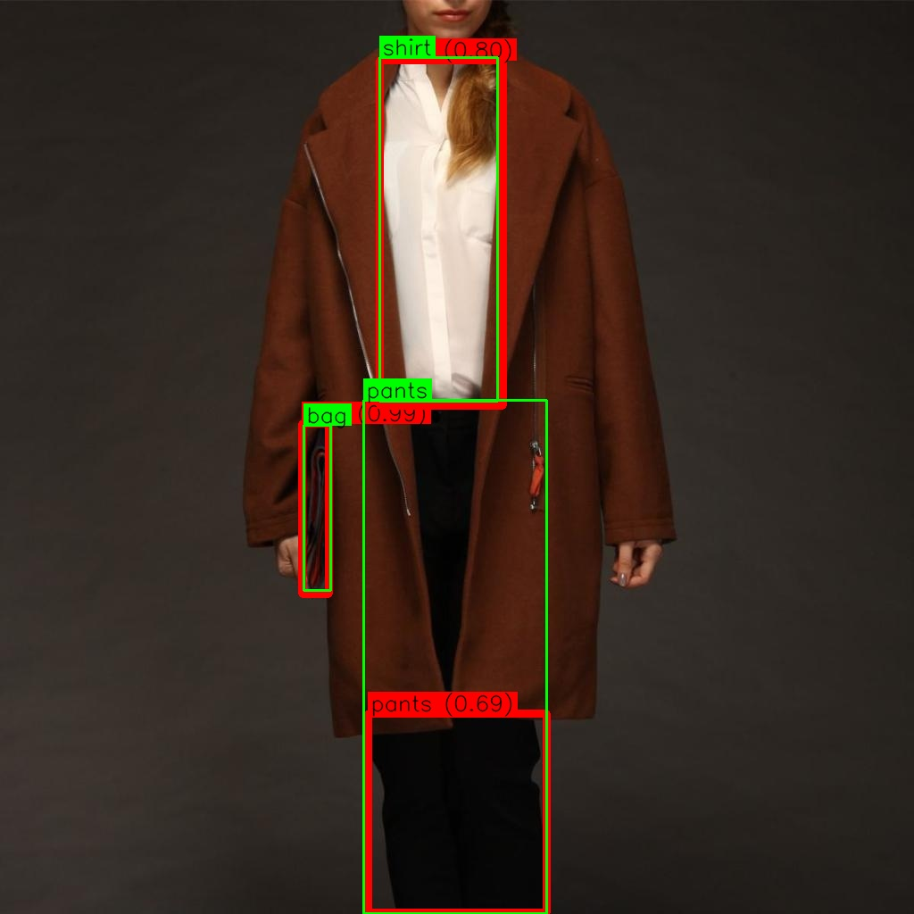
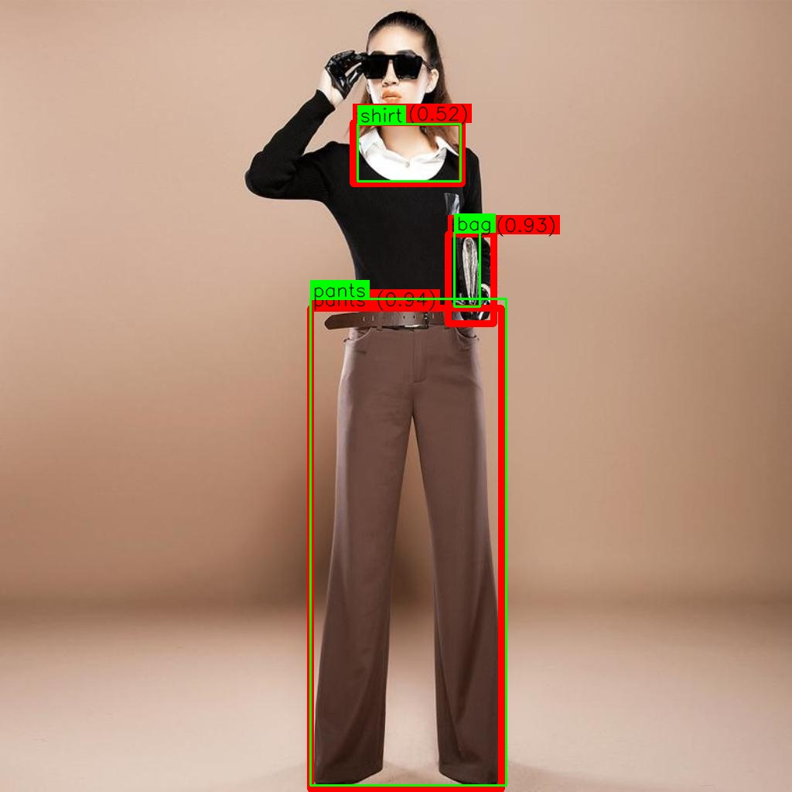

# Grounding DINO Fine-tuning 🦖


We have expanded on the original DINO  repository 
https://github.com/IDEA-Research/GroundingDINO 
by introducing the capability to train the model with image-to-text grounding. This capability is essential in applications where textual descriptions must align with regions of an image. For instance, when the model is given a caption "a cat on the sofa," it should be able to localize both the "cat" and the "sofa" in the image.

## Features:

- **Fine-tuning DINO**: This extension works allows you to fine-tune DINO on your custom dataset.
* **Hungarian Matcher**: Hungarian matching between predictions and ground truth as per original paper 
* **EMA Model**: Exponential Moving Average model to retain pre-trained knowledge
* **Flexible LR Scheduling**: Supports Step and Onecycle LR schedulers
* **Example Dataset**: Includes small sample dataset for training and testing
- **NMS (Optional)**: We also implemented phrase based NMS to remove redundant boxes of same objects (might be useful if you have too many detections original DETR like model which grouding dino is also based on donot require NMS)


## Installation:
See original Repo for installation of required dependencies essentially we need to install prerequisits  

pip install -r reqirements.txt

then install the this package

pip install -e .

## Dataset

Dataset is a subset of fashion dataset availbale in hugging face with categories bag, shirt and pant e.t.c. A random subset of only 200 images are selected for training containing only three categoreis, also random 50 images containing these three categories are choosen for test images, you can get the sample dataset from here [GoogleDrive](https://drive.google.com/file/d/1D2qphEE98Dloo3fUURRnsxaIRw076ZXX/view?usp=drive_link) 

## Train: 

1. Prepare your dataset with images and associated textual captions. A tiny dataset is given multimodal-data to demonstrate the expected data format.
3. Run the train.py for training.
  ```
  python train.py
  ```

## Test:
Visualize results of training on test images
```
python test.py
```


## Qualitative Results

For Input text "shirt. pants. bag" and input validation images (see above like for train and valiadtion data. The model was only trained on 200 images and tested on 50 images) 


**Before Fine-tuning**: Model performs as shown on left. GT is shown in green and model predictions are shown in red. Interesting to know that for this dataset model does not perform very bad since but the concept of e.g "shirt" is different then the GT see second and third image 

**After Fine-tuning**: Model correctly detects all required categories image one along with the correct concept of shirt


<div align="center">
 <p float="left" align="middle">
   
   
 </p>
</div>

<div align="center">
 <p float="left" align="middle">
   
   
 </p>
</div>

<div align="center">
 <p float="left" align="middle">
   
   
 </p>
</div>


## Contributing
Feel free to open issues, suggest improvements, or submit pull requests. If you found this repository useful, consider giving it a star to make it more visible to others!

TO DO:

1. Add model evaluation
2. Add LORA for finetuning so model can retrain its original open vocabulary capaciry,
3. We did not added auxilary losses as mentioned in the original paper, as we feel we are just finetuning an already trained model but feel free to add auxillary losses and compare results

