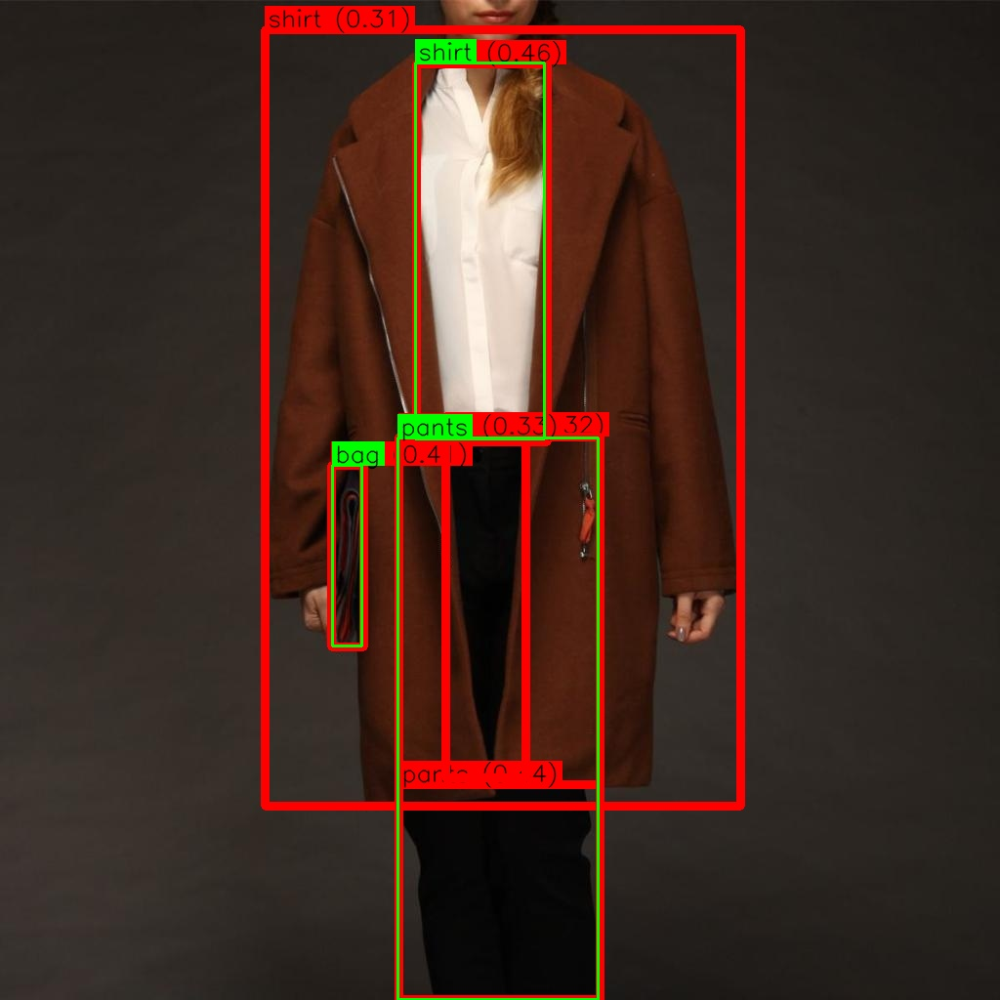
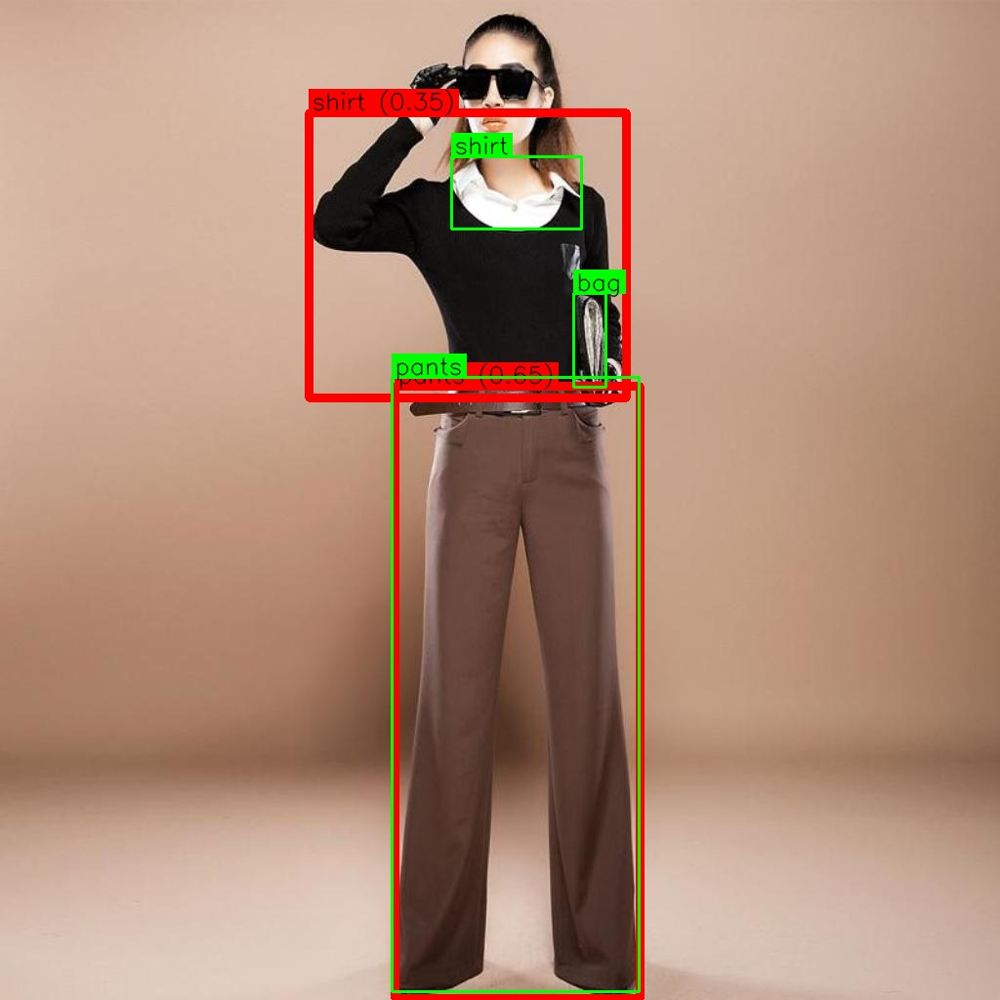

# Grounding DINO Fine-tuning 🦖


We have expanded on the original DINO  repository 
https://github.com/IDEA-Research/GroundingDINO 
by introducing the capability to train the model with image-to-text grounding. This capability is essential in applications where textual descriptions must align with regions of an image. For instance, when the model is given a caption "a cat on the sofa," it should be able to localize both the "cat" and the "sofa" in the image.

## Features:

- **Fine-tuning DINO**: This extension works allows you to fine-tune DINO on your custom dataset.
- **EMA Model**: Exponential Moving Average model to retain pre-trained knowledge
- **LORA Training** (New) : Parameter-efficient fine-tuning using LORA that trains less than 2% of parameters while maintaining performance. For example we use a rank of 32 for the LORA adapters you can aso try smaller ranks. **LoRA only saves the newly introduced parameters, significantly reducing the storage space required for fine-tuned models. During inference, these LoRA parameters are merged with the base model weights.**
* **Example Dataset**: Includes small sample dataset for training and testing
- **NMS (Optional)**: We also implemented phrase based NMS to remove redundant boxes of same objects (might be useful if you have too many detections original DETR like model which grouding dino is also based on donot require NMS)


## Installation:
See original Repo for installation of required dependencies essentially we need to install prerequisits  

```bash
pip install -r reqirements.txt
```
then install the this package
```bash
pip install -e .
```

Optional:
You might need to do this if you have an old gpu or if its arch is not recognized automatically

```bash
## See if the CUDA_HOME is set up correctly
## e.g export CUDA_HOME=/usr/local/cuda
pip uninstall groundingdino
nvidia-smi --query-gpu=gpu_name,compute_cap --format=csv
export TORCH_CUDA_ARCH_LIST="6.0;6.1;7.0;7.5;8.0;8.6" (add your gpu arch given from previous)
export FORCE_CUDA=1
pip install -e .

```


## Dataset

Dataset is a subset of fashion dataset availbale in hugging face with categories bag, shirt and pant e.t.c. A random subset of 200 images are selected for training containing three categoreis, also random 50 images containing these three categories are choosen for test images, you can get the sample dataset from here [GoogleDrive](https://drive.google.com/file/d/1D2qphEE98Dloo3fUURRnsxaIRw076ZXX/view?usp=drive_link) and put it inside multimodal-data to use data as it is.

## Train: 

1. Prepare your dataset with images and associated textual captions. A tiny dataset is given multimodal-data to demonstrate the expected data format.
2. Run the train.py for training. We use a batch size of 8, a learning rate of 1e-5, and the AdamW optimizer. The model is trained for 100 epochs. **See `configs/train_config.yaml` for detailed training configurations.**

  ```
  python train.py
  ```

### Multi-GPU Training with Accelerate:

For multi-GPU training, we provide `train_multigpu.py` which uses HuggingFace Accelerate:

```
accelerate launch train_accelerate.py configs/train_config.yaml
```

Accelerate can be configured for different setups. You can also configure Accelerate interactively:

```
accelerate config
```

Some example configutrations are: 

Single GPU Configuration:
```yaml
compute_environment: LOCAL_MACHINE
distributed_type: NO
```

Multi-GPU Configuration (e.g., 2 GPUs):
```yaml
compute_environment: LOCAL_MACHINE
distributed_type: MULTI_GPU
num_processes: 2
```

Then run with:
```
accelerate launch --config_file accelerate_config.yaml train_accelerate.py configs/train_config.yaml
```

## Test:
Visualize results of training on test images. **See `configs/test_config.yaml` for detailed testing configurations.**

```
python test.py
```

## Qualitative Results

For Input text "shirt. pants. bag" and input validation images (see above like for train and valiadtion data. The model was only trained on 200 images and tested on 50 images) 


**Before Fine-tuning**: Model performs as shown on left below. GT is shown in green and model predictions are shown in red. Interesting to note is that for this dataset model does not perform very bad, but the concept of some categories is different e.g "shirt" is different then the GT see second and third image. 

**After Fine-tuning**: Model correctly detects all required categories image one along with the correct concept.


<div align="center">
 <p float="left" align="middle">
   
   
 </p>
</div>

<div align="center">
 <p float="left" align="middle">
   
   
 </p>
</div>

<div align="center">
 <p float="left" align="middle">
   
   
 </p>
</div>


## Contributing
Feel free to open issues, suggest improvements, or submit pull requests. If you found this repository useful, consider giving it a star to make it more visible to others!

TO DO:

1. Add model evaluation
2. ~~Add LORA for finetuning y~~✅
3. We did not added auxilary losses as mentioned in the original paper, as we feel we are just finetuning an already trained model but feel free to add auxillary losses and compare results